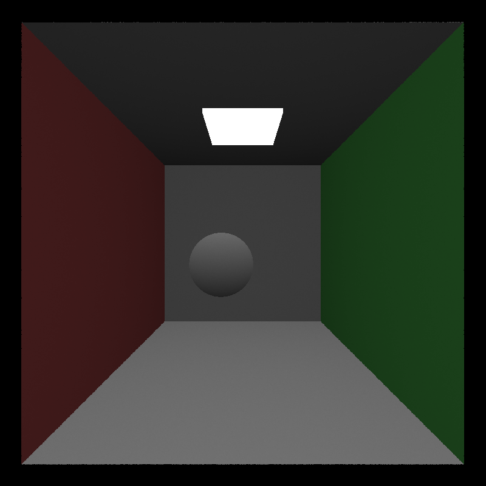

CUDA Path Tracer
================

**University of Pennsylvania, CIS 565: GPU Programming and Architecture, Project 3**

* Zachary Kelly
* Tested on: Windows, NVIDIA GeForce RTX 3070 8 GB
* Visual Studio 2022, CUDA 13.3, NVIDIA driver 616.56, Release build

## Build and Run

Run these commands in PowerShell from the project folder:

```powershell
cmake -S . -B build -G "Visual Studio 17 2022" -A x64
cmake --build build --config Release -j 8
.\build\bin\Release\cis565_path_tracer.exe scenes/cornell.json
```

The build needs CMake 3.24 or newer, the Visual Studio C++ tools and Windows SDK,
and the CUDA toolkit. The Windows OpenGL dependencies are included in `external`.
The CUDA architecture is selected from the local GPU by the starter CMake file.

To run from Visual Studio, open the solution in `build` and select Release/x64.
The startup project uses the Cornell scene and the project folder as its working
directory. Change the scene argument to `scenes/sphere.json` for the sphere example.

The scene's `ITERATIONS` setting controls when rendering finishes. At that point,
the starter saves a PNG in the working directory and exits. The filename includes
the scene name, launch time, and sample count.

## Controls

* Left drag: orbit the camera.
* Right drag: zoom.
* Middle drag: move the camera's look-at point along the ground plane.
* Space: restore the original look-at point (not the original orbit or zoom).
* S: save an image.
* Esc: save and exit.

## Stage 1: Starter Baseline



This is the provided fake shader at 800 by 800 pixels and 5000 samples. It only
traces one bounce, so this image is a baseline for later changes, not a completed
path tracer. Diffuse scattering and indirect lighting still need to be implemented.

Verified the Release build, CUDA/OpenGL preview, automatic PNG saving, and camera
orbit with sample accumulation restarting after movement. The renderer completed
the baseline run with exit code 0.

### Control Verification

The optional integration checks open a real OpenGL window and render CUDA frames.
They call the installed GLFW/ImGui callbacks with controlled input values, then
check camera positions, sample resets, saved files, and the window-close flag.
All 18 checks passed in Release mode. The S and Escape PNGs were identical, and
the saved image was opened to verify it contained the rendered scene.

```powershell
cmake -S . -B build -DBUILD_CONTROL_CHECKS=ON
cmake --build build --config Release -j 8
.\build\bin\Release\control_checks.exe scenes/cornell.json
```

The checks cover vertical right-drag zoom and its minimum distance, horizontal
and vertical middle-drag pan, camera updates and accumulation resets, releasing
a drag over the UI, Space recentering, and S/Escape saving. Output goes into a
timestamped folder under `build`. These checks require a GPU and desktop session.
They verify behavior from the installed callback onward, not physical device
delivery. The earlier desktop automation could orbit but did not trigger S/Esc;
that input-delivery issue is still unverified.

Found and fixed a starter bug that ignored movement when either cursor coordinate
stayed unchanged. This blocked straight vertical zoom and straight pan drags.
A drag now starts from the current cursor position, and releasing over the UI
still releases the camera button. Image cleanup now uses `delete[]` to match its
array allocation.

The build reports warnings in the bundled `stb_image.h` and a runtime-library
link warning (LNK4098), but it links and renders successfully.

### CMake Changes

Enabled MSVC's standard preprocessor with `/Zc:preprocessor`, including forwarding
it through nvcc for CUDA files. Without it, this machine's CUDA 13.3 Thrust headers
stop compilation. Also set the Visual Studio debugger's scene argument and working
directory so the Run button can find the sample scene.
Added the optional `BUILD_CONTROL_CHECKS` target for the control checks above;
it is off by default.

