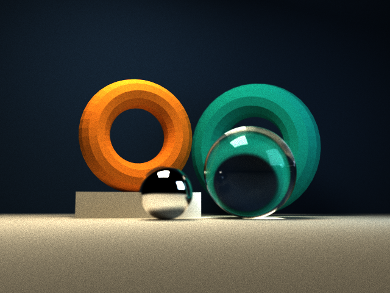
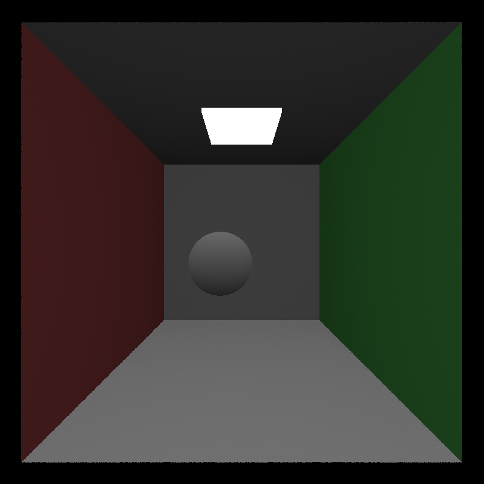
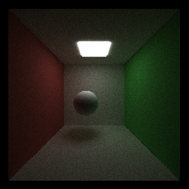
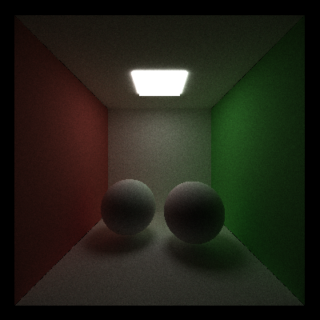
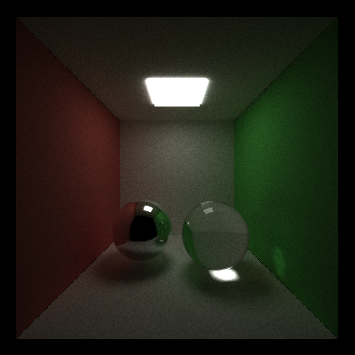
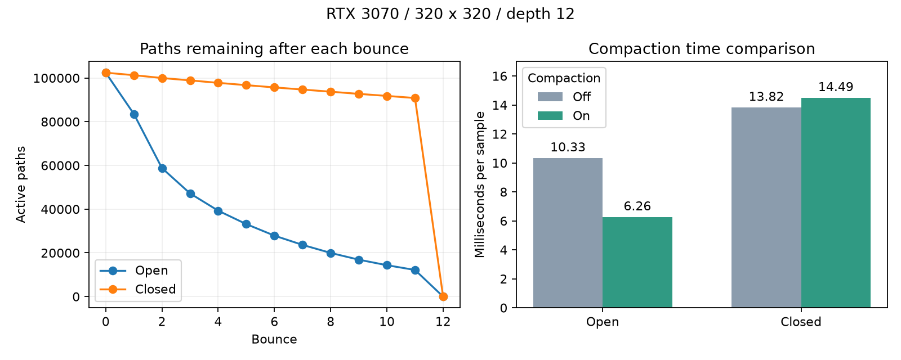
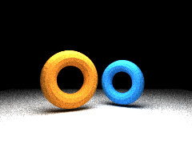
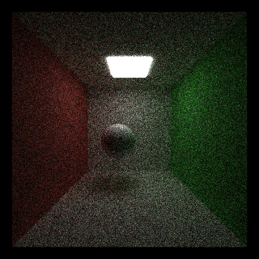
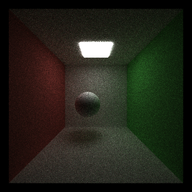

# CUDA Path Tracer

**University of Pennsylvania, CIS 565: GPU Programming and Architecture — Project 3**

Zachary Kelly

Tested on Windows with an NVIDIA GeForce RTX 3070 8 GB, Visual Studio 2022,
CUDA 13.3, and NVIDIA driver 616.56. All timings below use a Release build.



This path tracer supports diffuse lighting, mirrors, glass, antialiasing,
glTF meshes, depth of field, and direct light sampling. The scene above brings
these together with two torus meshes, two spheres, and warm and cool area lights.
The meshes were generated for this project.

There are also toggles for stream compaction, material sorting, and mesh
bounding-box culling. Compaction helped in the open scene, while sorting actually
made both benchmark scenes slower. The comparisons below show where each change
helped and where its overhead outweighed the benefit.

## Build and run

Run from the repository root in PowerShell:

```powershell
cmake -S . -B build -G "Visual Studio 17 2022" -A x64
cmake --build build --config Release -j 8
.\build\bin\Release\cis565_path_tracer.exe scenes/showcase.json
```

The project needs CMake 3.24 or newer, the Visual Studio C++ tools and Windows
SDK, and CUDA. The Windows OpenGL dependencies are included in `external`.
The starter CMake configuration selects the CUDA architecture from the local GPU.

For Visual Studio, open the solution in `build` and select Release/x64. The
debugger is set up to run the Cornell scene from the repository root. Change its
scene argument to try another JSON file, such as `scenes/sphere.json`.

Rendering stops at the scene's `ITERATIONS` count and saves a PNG. Output names
include the launch time and sample count. Mesh filenames are relative to the
scene file; image output paths are relative to the working directory.

| Input | Action |
| --- | --- |
| Left drag | Orbit |
| Right drag | Zoom |
| Middle drag | Pan the look-at point along the ground plane |
| Space | Restore the original look-at point; keep the current orbit and zoom |
| S | Save an image |
| Esc | Save and exit |

Moving the camera restarts accumulation. Scene settings are read at startup,
so changing the JSON requires restarting the renderer.

## Diffuse lighting

| Starter shader | Diffuse path tracing |
| --- | --- |
|  |  |

The starter image is an 800 × 800 render at 5000 samples using the provided
single-bounce fake shader. The diffuse image uses `scenes/cornell-diffuse.json`
at 320 × 320, 1500 samples, and depth 8. These show the change in lighting, not
a comparison at equal settings. The diffuse render has soft shadows and color
bleeding, though some noise is still visible.

Each path follows diffuse bounces until it reaches a light, escapes, or runs out
of bounces. The starter's cosine-weighted hemisphere sampler chooses the next
direction, and each bounce multiplies the path throughput by the surface color.
For this BSDF-only version, a path contributes only if it reaches an emitter.
Direct light sampling, described below, adds another way to find those lights.

Scattered rays start a small distance off the surface in world space to avoid
hitting the same surface again. The intersection point itself no longer includes
the starter's object-space offset. Box intersections also handle parallel rays
and rays starting inside the box.

```powershell
.\build\bin\Release\cis565_path_tracer.exe scenes/cornell-diffuse.json
```

## Mirrors and glass

| Diffuse surfaces | Mirror and glass |
| --- | --- |
|  |  |

Both images are 400 × 400 at 3000 samples and depth 12. The right image uses
`scenes/cornell-materials.json`; the left changes both spheres to diffuse materials.

Mirror surfaces use perfect reflection. Glass chooses between reflection and
transmission using Schlick's approximation, with total internal reflection when
the ray cannot leave the material. The default index of refraction is 1.5:

```json
"glass": {
    "TYPE": "Refractive",
    "RGB": [1.0, 1.0, 1.0],
    "IOR": 1.5
}
```

Keeping normals pointed outward is important here: their direction tells the
shader whether a ray is entering or leaving the object. The new ray origin is
offset toward the side it travels into. Transmitted camera paths also multiply
throughput by the squared IOR ratio for radiance transport. Those factors cancel
when a ray passes from air through glass and back into air. The material's RGB
value tints each interaction.

These materials assume smooth surfaces and separate glass objects surrounded by
air. Roughness, volume absorption, and nested or overlapping dielectrics are not
implemented.

### Refraction cost

To measure refraction, the benchmark replaces only the glass sphere with diffuse
white and leaves the mirror sphere and other settings alone.

| Glass replaced with diffuse white | Glass enabled | Change |
| ---: | ---: | ---: |
| 13.63 ms/sample | 14.69 ms/sample | 7.8% more time |

This uses 400 × 400, depth 12, direct lighting, antialiasing, and compaction on,
and sorting off. Each mode has three alternating runs of 50 samples after five
warmups. The timings include the complete `pathtrace` call, synchronization,
and image download. Changing the material also changes path lengths and
visibility, so the difference includes more than the cost of the refraction math.
[Raw measurements](img/refraction-timings.txt).

Glass paths can stay alive through several interfaces, and the reflection versus
transmission choice adds branch divergence. A CPU could use the same equations;
the GPU benefits from tracing many independent pixel paths at once. A BVH would
help reduce intersection work on longer paths. Rough glass and nested media
would need changes to the material and medium model.

```powershell
.\build\bin\Release\cis565_path_tracer.exe scenes/cornell-materials.json
.\build\bin\Release\pathtrace_checks.exe scenes/cornell-materials.json --benchmark-refraction
```

## Stream compaction

After each bounce, `thrust::remove_if` packs the surviving paths together. Light
hits write their contribution to the image before removal. Paths keep their
original pixel indices, so moving them changes neither their random samples nor
the pixels they write to. The loop ends early if no paths remain.

Set `STREAM_COMPACTION` in `Camera` to turn this on or off. It defaults to `true`.
This uses Thrust's implementation, not a custom shared-memory scan.



| Scene | Compaction off | Compaction on | Change |
| --- | ---: | ---: | ---: |
| Open | 10.33 ms/sample | 6.26 ms/sample | 39.4% less time |
| Closed | 13.82 ms/sample | 14.49 ms/sample | 4.9% more time |

The open scene drops from 102400 paths to 12169 after bounce 11. In the closed
scene, 90820 paths are still active. Compaction helps the open scene because
later bounces have much less work to do. In the closed scene it mostly moves
paths that are still alive, and that overhead makes the render slightly slower.
Both counts reach zero at bounce 12 because of the depth limit. The plotted
counts come from the first sample.

These runs use 320 × 320 and depth 12. Each mode has three 50-sample runs after
five warmups, with the order alternated. The host timings cover the full
`pathtrace` call, including compaction, synchronization, display-buffer conversion,
and image download. There is no OpenGL window, and path counting is disabled
during timing.

A CPU would also benefit from skipping finished paths. On the GPU, packing the
array reduces idle lanes as well, but moving data still costs time. Skipping
compaction when few paths have ended, or reusing temporary storage, would be
worth testing.

Raw measurements: [open scene](img/compaction-open.txt),
[closed scene](img/compaction-closed.txt).

```powershell
.\build\bin\Release\pathtrace_checks.exe scenes/benchmark-open.json --benchmark
.\build\bin\Release\pathtrace_checks.exe scenes/benchmark-closed.json --benchmark
```

`python tests/plot_compaction.py` regenerates the plot using Matplotlib.

## Material sorting

With `MATERIAL_SORTING` enabled, `thrust::sort_by_key` groups intersections by
material ID before shading. It moves each path together with its intersection,
so the shader still sees the correct pair. Misses and finished paths use ID -1.
The original pixel index stays with the path.

| Scene | Sorting off | Sorting on | Relative time |
| --- | ---: | ---: | ---: |
| Open | 7.16 ms/sample | 20.04 ms/sample | 2.80x |
| Closed | 16.93 ms/sample | 36.32 ms/sample | 2.15x |

Sorting was slower in both scenes, so it is off by default. Grouping materials
can reduce divergence, but the diffuse, mirror, and glass shaders here are
fairly small. Sorting and moving the full path/intersection records costs more
than it saves in these tests.

The mixed-material scenes use 320 × 320, depth 12, compaction and antialiasing
on. Each mode has three alternating 50-sample runs after five warmups. Timings
include the whole `pathtrace` call; path counts are collected separately. These
measurements do not isolate shading time or directly measure warp divergence.

Sorting smaller keys and indices, reusing scratch memory, or sorting less often
might lower the overhead. Grouping materials could also help a CPU's memory
accesses, though its branching behavior differs from a GPU warp.

The tests compare every pixel and the active-path counts across all four
sorting/compaction combinations, with antialiasing both on and off.

Raw measurements: [open scene](img/sorting-open.txt),
[closed scene](img/sorting-closed.txt).

```powershell
.\build\bin\Release\pathtrace_checks.exe scenes/benchmark-open.json --benchmark-sorting
.\build\bin\Release\pathtrace_checks.exe scenes/benchmark-closed.json --benchmark-sorting
```

## Antialiasing

| Pixel-center samples | Random samples within each pixel |
| --- | --- |
|  |  |

Each iteration picks a uniform random position inside each pixel. Averaging
these samples estimates how much of the pixel an object covers, which smooths
its edges. Camera sampling has a separate random seed from scattering and
repeats the same sequence after a reset.

`ANTIALIASING` defaults to `true`. When disabled, rays pass through pixel centers.
Both modes use the same pixel footprint; the difference is the jitter.

The images use `scenes/antialiasing.json` at 128 × 128 and 1024 samples. Emissive
geometry makes the edges easy to compare without indirect-lighting noise. Set
`ANTIALIASING` to `false` for the left image. A separate test covers exactly half
a pixel with a surface: jittered samples approach 50% brightness, while the
fixed center ray always hits it.

```powershell
.\build\bin\Release\cis565_path_tracer.exe scenes/antialiasing.json
```

## glTF meshes



These two torus instances contain 1920 triangles altogether. The image uses
240 × 180, 768 samples, and depth 6. `tests/make_mesh_assets.py` generates the
torus and the loader test fixtures.

Meshes use the same material and transform fields as other scene objects:

```json
{
    "TYPE": "mesh",
    "FILE": "meshes/torus.gltf",
    "MATERIAL": "gold",
    "TRANS": [-1.3, 1.6, 0.0],
    "ROTAT": [0.0, 25.0, 0.0],
    "SCALE": [1.4, 1.4, 1.4]
}
```

The loader reads static triangle geometry from glTF 2.0 `.gltf` and `.glb` files.
It supports external and base64 buffers, indexed and unindexed primitives,
accessor offsets and strides, and node hierarchies. Nodes can use matrices or
translation/rotation/scale transforms. Positions are floats; indices can be
unsigned 8-, 16-, or 32-bit values. The CPU applies the transforms and builds
world-space triangles before uploading them to the GPU.

The importer uses flat normals and the material named in the scene JSON. It does
not load glTF PBR materials, textures, or vertex normals, and it does not evaluate
animation tracks. Skins, morph targets, sparse accessors, non-triangle primitives,
and required extensions such as compressed geometry are rejected. Buffer ranges,
vertex indices, and node cycles are checked too.

The loader uses the starter's JSON library, with no additional model-loading
library. The format reference is the
[Khronos glTF 2.0 specification](https://registry.khronos.org/glTF/specs/2.0/glTF-2.0.html).

### Bounding-box culling

Each mesh has a world-space axis-aligned bounding box. If a ray misses it, the
renderer skips that mesh's triangles. The bounds test also uses the closest hit
already found to limit the search. Triangle intersections are two-sided.
`MESH_CULLING` defaults to `true`.

| Culling off | Culling on | Reduction |
| ---: | ---: | ---: |
| 15.91 ms/sample | 10.88 ms/sample | 31.6% |

This uses `scenes/benchmark-mesh.json` at 320 × 240, depth 6, and 1920 triangles,
with antialiasing and compaction on and sorting off. Each mode has three
alternating 50-sample runs after five warmups. Timings include the complete
`pathtrace` call, synchronization, and image download.
[Raw measurements](img/mesh-culling.txt).

Culling gives the same image with less intersection work. The saved 768-sample
mesh renders with culling on and off have identical SHA-256 hashes. It would
also help on a CPU, since a missed box avoids the same triangle scan. Rays that
enter the box still test every triangle, though. A triangle BVH would be the
next improvement for larger meshes.

```powershell
.\build\bin\Release\cis565_path_tracer.exe scenes/mesh-preview.json
.\build\bin\Release\pathtrace_checks.exe scenes/benchmark-mesh.json --benchmark-culling
```

## Depth of field

| Pinhole camera | Thin lens |
| --- | --- |
|  |  |

The middle ring is in focus. The pink ring is closer to the camera, and the blue
ring is farther away. Both images use 300 × 180 and 1024 samples. The meshes are
emissive so lighting noise does not hide the difference in focus.

These optional fields go in `Camera`:

```json
"APERTURE_RADIUS": 0.6,
"FOCAL_DISTANCE": 9.0
```

For each pixel ray, the renderer finds its intersection with the focal plane,
picks a uniform point on a circular aperture, and aims from there at the focal
point. Lens samples use a separate random stream from antialiasing and scattering.

Both settings are in world units. `FOCAL_DISTANCE` is measured along the camera's
view direction and defaults to the initial eye-to-look-at distance. An aperture
radius of zero, the default, gives the pinhole camera. Focus distance stays fixed
while orbiting or zooming; change the JSON and restart to refocus. This is an
ideal thin lens, without lens aberrations or exposure changes from aperture size.

The pinhole scene averaged **1.776 ms/sample**, compared with **1.780 ms/sample**
with the lens enabled. These are three alternating 50-sample runs after five
warmups. The difference is smaller than the variation between runs, so there
is no clear timing change in this scene.
[Raw measurements](img/depth-of-field-timings.txt).

Generating lens samples is cheap and independent per pixel on either CPU or
GPU. Defocus still needs enough samples to look smooth, and the less coherent
rays may make traversal more expensive in a larger scene. Better sampling
sequences could help reduce the noise.

```powershell
.\build\bin\Release\cis565_path_tracer.exe scenes/depth-of-field.json
.\build\bin\Release\cis565_path_tracer.exe scenes/depth-of-field-pinhole.json
.\build\bin\Release\pathtrace_checks.exe scenes/depth-of-field.json --benchmark-dof
```

## Direct light sampling

| BSDF sampling only | Direct light sampling with MIS |
| --- | --- |
|  |  |

Both images use 320 × 320, 128 samples, and depth 8. Direct sampling makes the
lighting much less noisy at this sample count. `DIRECT_LIGHTING` defaults to
`true`; set it to `false` to use only BSDF sampling.

At a diffuse hit, the renderer picks one emissive object uniformly, samples a
point on it, and traces a shadow ray. Box faces and mesh triangles are also
chosen uniformly, with those probabilities included in the area PDF. Sphere
samples start on the object-space sphere, and their PDFs account for the surface
area change under nonuniform scaling. Emission is two-sided.

Direct sampling and the ordinary diffuse bounce can both find the same light,
so their contributions use multiple importance sampling (MIS) with the power
heuristic. The direct sample's weight uses its light PDF and the diffuse BSDF
PDF. When a scattered ray later hits a light, its contribution gets the
complementary weight from the previous hit point and BSDF PDF. Camera rays and
perfect mirror/glass bounces keep their unweighted emission.

The shadow test includes the light itself, which prevents a sample on its far
side from shining through the near side. It stops just before the sampled point,
so geometry beyond the light does not block it. Boxes, spheres, and meshes can
all act as lights or occluders; mesh shadow tests use the culling toggle.

Glass blocks these straight shadow rays. Light that refracts through glass is
still found by ordinary scattering paths. Direct connections are sampled only
when the depth limit allows another surface interaction.

### Image quality and time

| Metric | Direct lighting off | Direct lighting on |
| --- | ---: | ---: |
| Mean time per sample, 320 × 320 | 6.11 ms | 10.01 ms |
| Linear RGB MSE at 128 samples, 64 × 64 | 0.0031842 | 0.000777654 |

The extra shadow rays cost about **64% more per sample**, but the error drops by
**75.6%** in this test. Timing uses depth 8, compaction and antialiasing on,
sorting off, and three alternating runs of 50 samples after five warmups. It
includes the full `pathtrace` call, synchronization, and image download.

The error test uses a separate 64 × 64 render. Its reference is a 4096-sample MIS
render with seeds 10001–14096; the 128-sample comparisons use seeds 1–128. MSE is
calculated from unclamped linear RGB before display conversion. The reference
still contains some noise, and these results are specific to this scene.

Raw results: [timings](img/direct-lighting-timings.txt),
[image error](img/direct-lighting-error.txt).

The GPU can trace the shadow rays in parallel, but each adds an intersection
query and potentially more divergence. A CPU would use the same estimator with
fewer rays running at once. Choosing lights by power, choosing faces/triangles by
area, and adding a BVH are possible ways to improve this implementation.

Algorithm reference:
[PBRT: A Better Path Tracer](https://pbr-book.org/4ed/Light_Transport_I_Surface_Reflection/A_Better_Path_Tracer).
The code uses the existing renderer and Thrust RNG.


`scenes/direct-lighting-dof.json` combines diffuse meshes, a box light, aperture
radius 0.35, and focal distance 8. This image uses 256 samples.

```powershell
.\build\bin\Release\pathtrace_checks.exe scenes/direct-lighting.json --benchmark-lighting
.\build\bin\Release\pathtrace_checks.exe scenes/direct-lighting.json --compare-lighting
.\build\bin\Release\cis565_path_tracer.exe scenes/direct-lighting.json
.\build\bin\Release\cis565_path_tracer.exe scenes/direct-lighting-off.json
.\build\bin\Release\cis565_path_tracer.exe scenes/direct-lighting-dof.json
```

## Final scene

The cover image uses `scenes/showcase.json` at **640 × 480, 2048 samples per pixel,
and depth 12**. It has two torus instances (1920 triangles), a diffuse floor and
backdrop, a glass sphere with IOR 1.5, a mirror sphere, and two box lights.

The aperture radius is 0.12 and focal distance is 11.1. Focus falls near the gold
ring, with the spheres in front and the teal ring farther back. The blur is subtle
here; the depth-of-field comparison above uses a wider aperture to show it more
clearly. The image is the saved renderer output, with no denoising or image edits.

Output filenames start with `build/showcase` and include the launch time and
sample count. `img/showcase.png` is the selected render. Lower `RES` and
`ITERATIONS` in the scene for a quick preview.

### Scene settings

| Camera field | Default | Purpose |
| --- | --- | --- |
| STREAM_COMPACTION | true | Remove finished paths after each bounce |
| MATERIAL_SORTING | false | Group paths and intersections by material |
| ANTIALIASING | true | Sample random positions within pixels |
| MESH_CULLING | true | Test mesh bounds before individual triangles |
| DIRECT_LIGHTING | true | Sample emitters and combine with BSDF samples using MIS |
| APERTURE_RADIUS | 0 | Lens radius; zero gives a pinhole camera |
| FOCAL_DISTANCE | Initial eye-to-look-at distance | Focus distance along the view direction |

The earlier mirror/glass, compaction, sorting, mesh, and lens comparisons were
made before direct lighting was added. Set `DIRECT_LIGHTING` to `false` to
reproduce those timing conditions. The isolated refraction benchmark and the
direct-lighting comparisons use the completed integrator.

All reported times measure whole renderer calls on the host, not isolated GPU
kernels. The CPU discussions are hypothetical; this project has no CPU renderer.

## Tests and starter fixes

Enable the optional test targets with:

```powershell
cmake -S . -B build -G "Visual Studio 17 2022" -A x64 -DBUILD_PATHTRACE_CHECKS=ON -DBUILD_CONTROL_CHECKS=ON
cmake --build build --config Release -j 8
.\build\bin\Release\pathtrace_checks.exe scenes/direct-lighting-dof.json
.\build\bin\Release\control_checks.exe scenes/cornell.json
```

The Release build and all **65 rendering/loader/lens/lighting checks** and
**18 control checks** passed again on September 27, 2026. The full 2048-sample
showcase render completed on September 26, and its saved image was checked at
640 × 480.

The rendering tests cover:

- Cosine-weighted sampling, emissive hits, accumulation, escaping rays, and depth limits.
- Mirror angles, Fresnel frequency, Snell's law, total internal reflection, and glass entry/exit radiance.
- Identical pixels and path counts with sorting and compaction toggled.
- Pixel-center sampling, half-pixel coverage, and repeatable camera samples.
- glTF/GLB buffer variants, interleaved vertices, unindexed meshes, mirrored transforms, invalid ranges, and node cycles.
- Nearest triangle hits, parallel/inside bounds rays, and identical images with mesh culling toggled.
- Lens origins inside the aperture, uniform disk sampling, focal-plane convergence, and zero-aperture behavior.
- Light PDFs, MIS weights, numerical integration of a square light, multiple lights, blockers, and camera/mirror/glass light hits.

The control tests open an OpenGL window and invoke the installed GLFW/ImGui
callbacks. They check zoom, pan, sample resets, releasing a drag over the UI,
Space recentering, and S/Escape saving. They test callback behavior rather than
physical keyboard/mouse delivery. Desktop automation previously failed to
trigger S/Escape, so that input-delivery path remains unverified. Saved files go
into a timestamped folder under `build`.

A starter input bug ignored movement if either cursor coordinate stayed the
same. Changing that condition fixed straight vertical zoom and straight pan
drags. Drags now start from the current cursor position, and releasing over the
UI clears the pressed button. The image destructor also uses `delete[]` to match
its array allocation.

The rendering checks need CUDA; the control tests and interactive renderer also
need an OpenGL desktop. Mesh assets and invalid-input fixtures are included, so
Python is not needed to build or run. `python tests/make_mesh_assets.py` recreates
the assets and fixtures.

### CMake changes

- Added `/Zc:preprocessor` for MSVC and forwarded it through nvcc. Without it, this machine's CUDA 13.3 Thrust headers fail to compile.
- Set the Visual Studio debugger's working directory and scene argument.
- Added `src/mesh.cpp` to the renderer and both test targets.
- Added `BUILD_CONTROL_CHECKS` and `BUILD_PATHTRACE_CHECKS`, both off by default.

The build has reported warnings in bundled `stb_image.h` and the LNK4098
runtime-library warning. It still links and renders successfully.

## Limitations and next steps

The biggest limitation for larger scenes is mesh traversal: one bounding box
can reject a mesh, but a ray inside it still scans all its triangles. A triangle
BVH would be the next performance improvement.

The depth limit cuts off longer light paths. Bright caustics and defocus can
still take many samples to converge. Better light selection and sampling
sequences could help. Material sorting needs a cheaper implementation before it
would make sense to enable it by default.

There are no rough reflections, textures, participating media, nested dielectric
tracking, or resumable renders. The importer uses flat triangles and scene
materials with the glTF restrictions described above. The starter's PNG output
clamps linear RGB without tone mapping or an sRGB transfer function.

## References and assets

The application framework, windowing, image output, GLM, and JSON library come
from the supplied starter. The renderer also retains its cosine-weighted
hemisphere sampler and uses Thrust from the CUDA toolkit. The torus and loader
fixtures are generated locally; there are no downloaded model assets.

The mesh loader follows the linked Khronos specification, and the direct-lighting
section links the PBRT discussion of MIS. The assignment's algorithm references
are also collected in [INSTRUCTION.md](INSTRUCTION.md).
